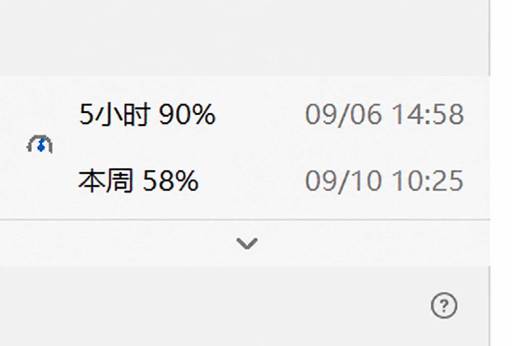
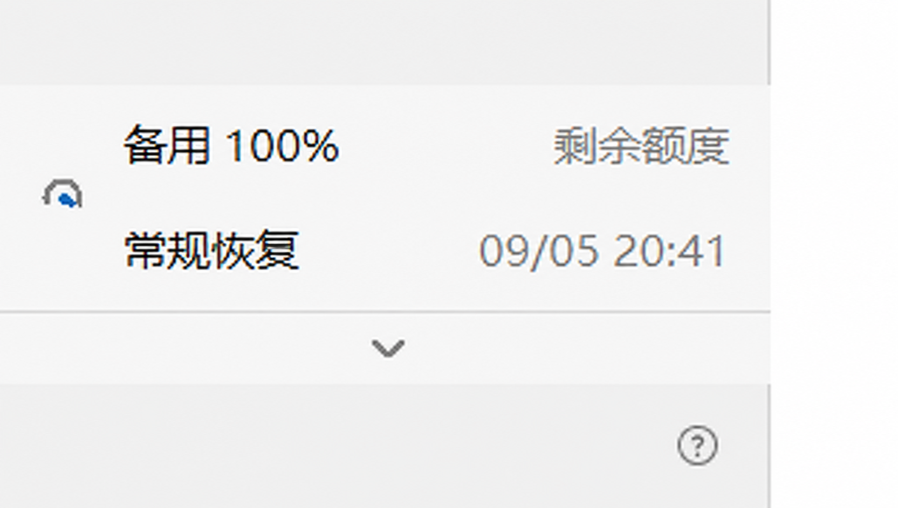

# Codex Usage Overlay

[](https://github.com/kkkpoipppp/codex-usage-overlay/actions/workflows/tests.yml)
[](LICENSE)

> 面向 Codex Windows 桌面版的非官方额度悬浮条。

这是一个轻量的 Windows 小程序。它通过 Codex 的本地只读接口获取
“5 小时剩余百分比”和“本周剩余百分比”，并固定显示在 Codex 左下角
用户名上方。

它不会修改 Codex 安装包，也不会读取 `auth.json`、密码或聊天正文。

## 界面预览

| 常规额度 | 备用额度 |
| --- | --- |
|  |  |

常规视图显示五小时和本周剩余额度及各自重置时间；备用视图显示备用剩余额度和常规额度恢复时间。图片经隐私处理，已移除头像和用户名；图中数值与时间仅作示例。

## 行为

- 仅在 Codex 窗口位于前台且没有最小化时显示，不会浮在其他应用上方。
- 以约 8ms 的定位节奏随 Codex 窗口移动、最小化和恢复；运行期间使用
  1ms 高精度计时，退出时自动释放。
- 点击左下角用户名区域后立即隐藏；再次点击用户名、点击菜单外部或按
  `Esc` 后恢复，不遮挡原生个人菜单。
- 自动适配 `config.toml` 中的浅色/深色主题。
- 每 30 秒读取一次账户额度，每 5 秒刷新界面；人工重置后会自动切换到
  新周期。点击用量条可立即刷新界面，右键退出。
- 只选择 `codex` 额度桶，不会再把 `gpt-reserve` 备用模型额度误显示为
  周额度；断网时才使用本机会话日志作为兜底。
- 分两行显示 `5小时 xx%` 和 `本周 xx%`；每行右侧显示对应额度的
  重置时间 `月/日 时:分`（Windows 本地时区）。缺失时间显示 `--`。
- 面板每100毫秒检查 Codex 保存的 `sidebar-width`，拖动侧栏分隔线时同步
  跟随鼠标宽度，松开后按保存值校准；无法读取时采用274像素兜底。
  展开高度为102像素，两行之间增加间距；
  底边保持在原用户名栏上方。
- 默认收起为 24 像素高的向上箭头区域；悬停或点击展开，向下箭头收起。
  鼠标移开 4 秒后自动收起；鼠标停留时保持展开。手动收起后须移开再移入
  才会再次触发展开。个人菜单打开或切换其他应用时自动收起并隐藏。
- 收起状态背景与分隔线透明，仅箭头可见，仍支持区域悬停展开。
- 常规额度耗尽后改为两行备用视图：备用剩余额度、常规额度恢复时间。
  从独立 `base_model_inference` 桶读取备用额度；缺失显示 `--`。
  耗尽的五小时窗口优先于周窗口；只有周限制时使用周恢复时间。
  此视图基于额度耗尽状态，不代表组件切换了实际对话模型。
- 单实例运行，重复启动不会出现多个用量条。

## 安装

### 环境要求

- Windows 10 或 Windows 11
- Codex Windows 桌面版
- Python 3.11 或更高版本，并安装 Tcl/Tk（标准 Python 安装通常已包含）
- PowerShell 5.1 或 PowerShell 7

### 使用方式

```powershell
git clone https://github.com/kkkpoipppp/codex-usage-overlay.git
cd codex-usage-overlay
```

然后双击 `install_codex_usage_overlay.bat`。安装程序会：

1. 复制程序到 `%LOCALAPPDATA%\CodexUsageOverlay`。
2. 在当前用户的“启动”目录创建快捷方式。
3. 立即启动用量条。

卸载时双击 `uninstall_codex_usage_overlay.bat`。卸载不会改动 Codex 本身。

## 临时运行

双击 `start_codex_usage_overlay.bat`，或者在终端检查数据：

```powershell
python codex_usage_overlay.py --once
```

## 测试

```powershell
python -B -m unittest test_codex_usage_overlay.py
```

## 隐私

程序不读取 `auth.json`、密码或聊天正文。额度通过 Codex 本地 app-server
只读方法获取；网络不可用时，仅扫描本机 `sessions` 中的 `rate_limits`
事件作为兜底。

## 许可证

[MIT License](LICENSE)
